# BC Ferries System Architecture

This document describes the data flow and architecture of the BC Ferries monitoring system deployed on Fly.io.

## System Components

| Component | Fly.io App | Public URL | Purpose |
|-----------|------------|------------|---------|
| Ferry Control | `bc-ferries-control-new` | ferry.linknode.com | Vessel simulator & control dashboard |
| Ops Dashboard | `bc-ferries-ops-dashboard` | ops.linknode.com | Operations center monitoring |
| MQTT Broker | `bc-ferries-mqtt-broker` | (internal only) | Message broker for pub/sub |

## High-Level Architecture

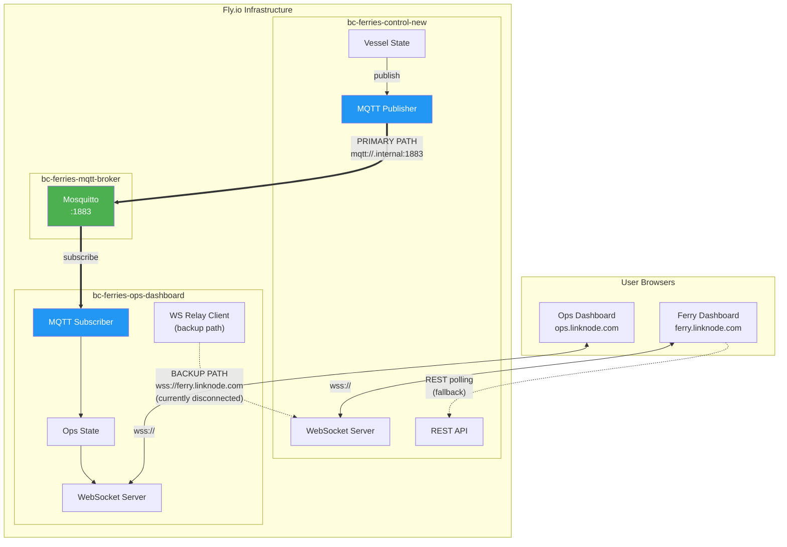

## Actual Data Flow (How It Really Works)

### Primary Path: MQTT Broker (Currently Active)

This is the **primary and currently functioning** data path. The ops-dashboard receives all vessel telemetry through MQTT subscriptions.

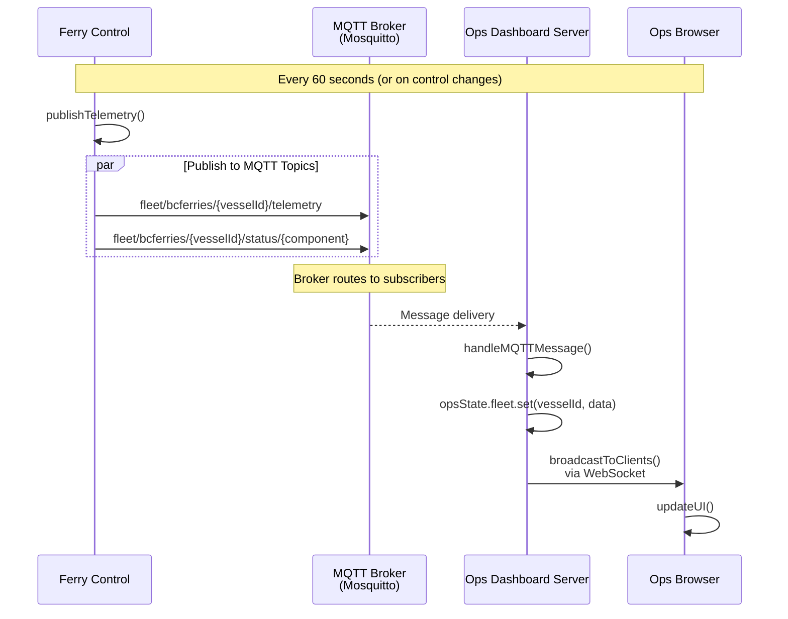

### Backup Path: WebSocket Relay (Currently Disconnected)

This path exists as a fallback but is **currently not connected**. The system functions entirely through MQTT.

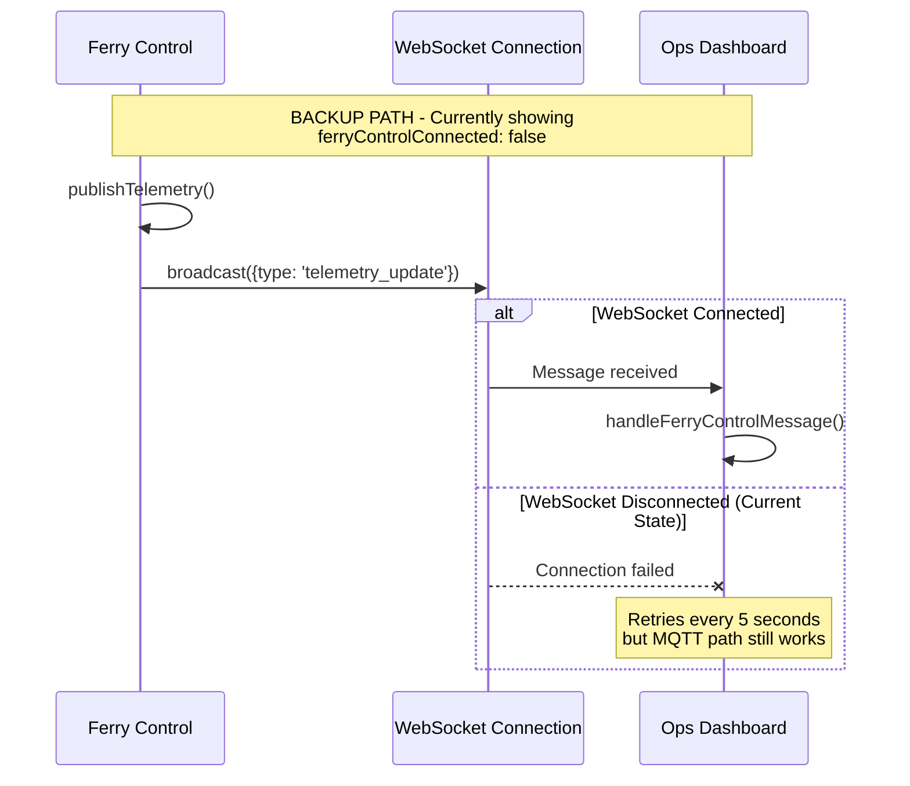

### Ferry Dashboard: Browser to Server

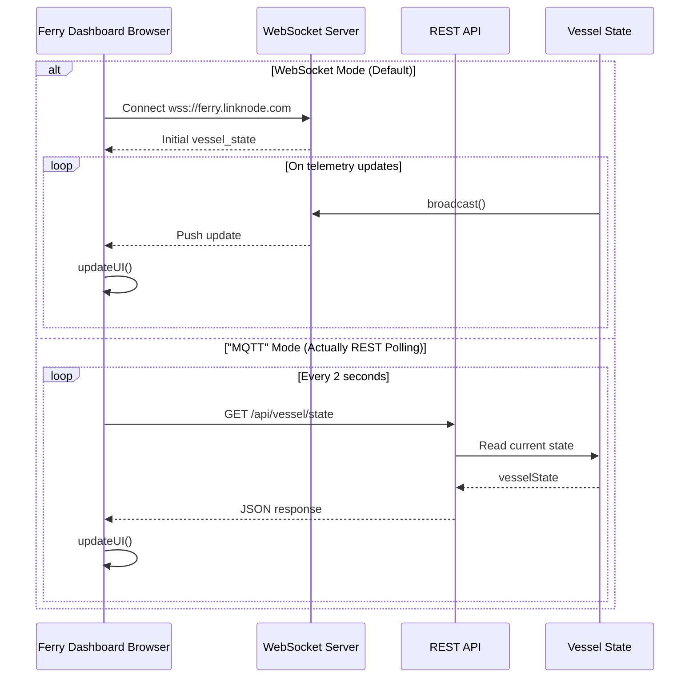

## Current System State

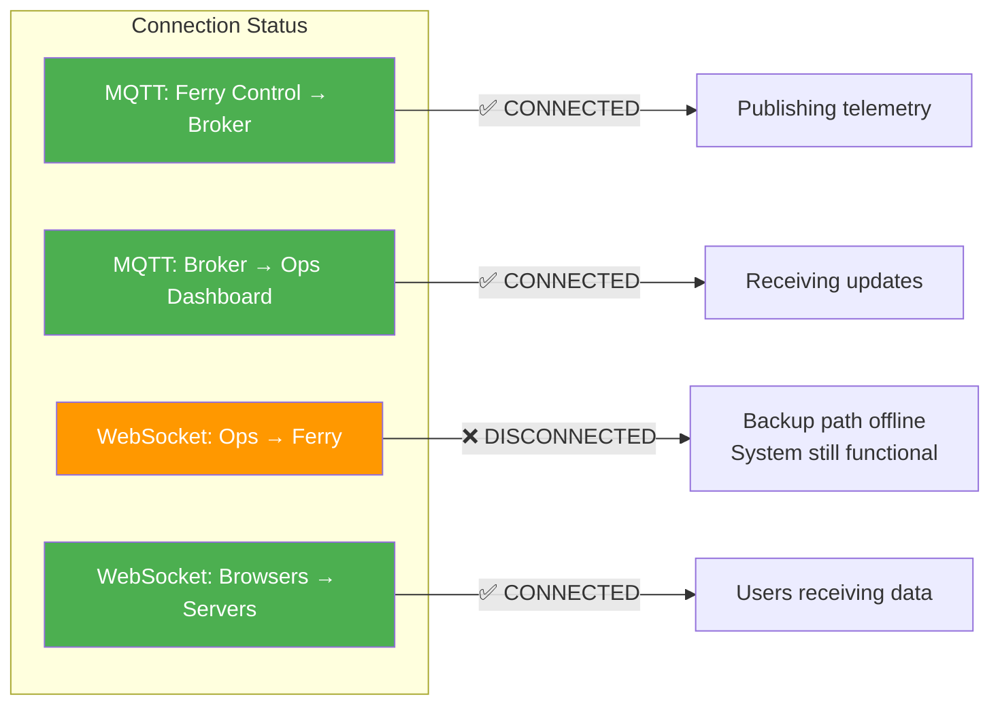

## Connection Configuration

### Environment Variables

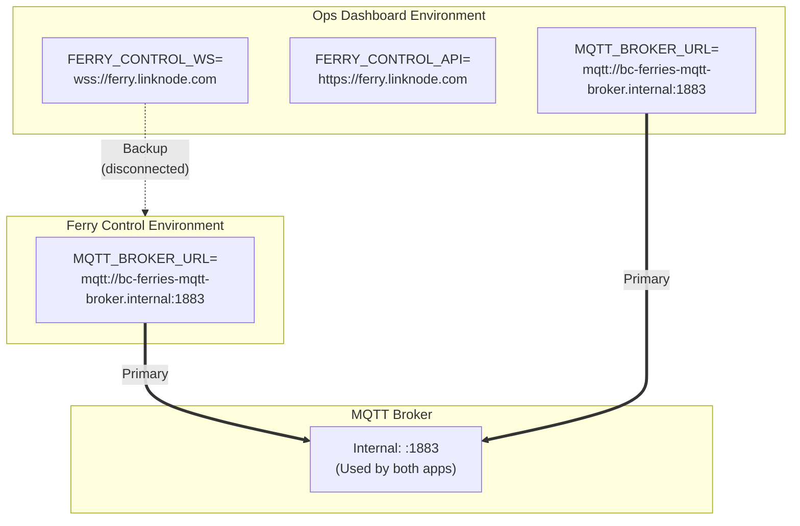

### MQTT Topics

| Topic Pattern | Publisher | Subscriber | QoS | Purpose |
|--------------|-----------|------------|-----|---------|
| `fleet/bcferries/{vesselId}/telemetry` | Ferry Control | Ops Dashboard | 1 | Regular telemetry updates |
| `fleet/bcferries/{vesselId}/emergency/{type}` | Ferry Control | Ops Dashboard | 2 | Emergency alerts (guaranteed) |
| `fleet/bcferries/{vesselId}/status/{component}` | Ferry Control | Ops Dashboard | 1 | System status (retained) |
| `fleet/bcferries/{vesselId}/heartbeat` | Ferry Control | Broker | 0 | Connection health |
| `fleet/bcferries/status/disconnect` | Ferry Control | Broker | 1 | LWT (Last Will & Testament) |

## Network Topology

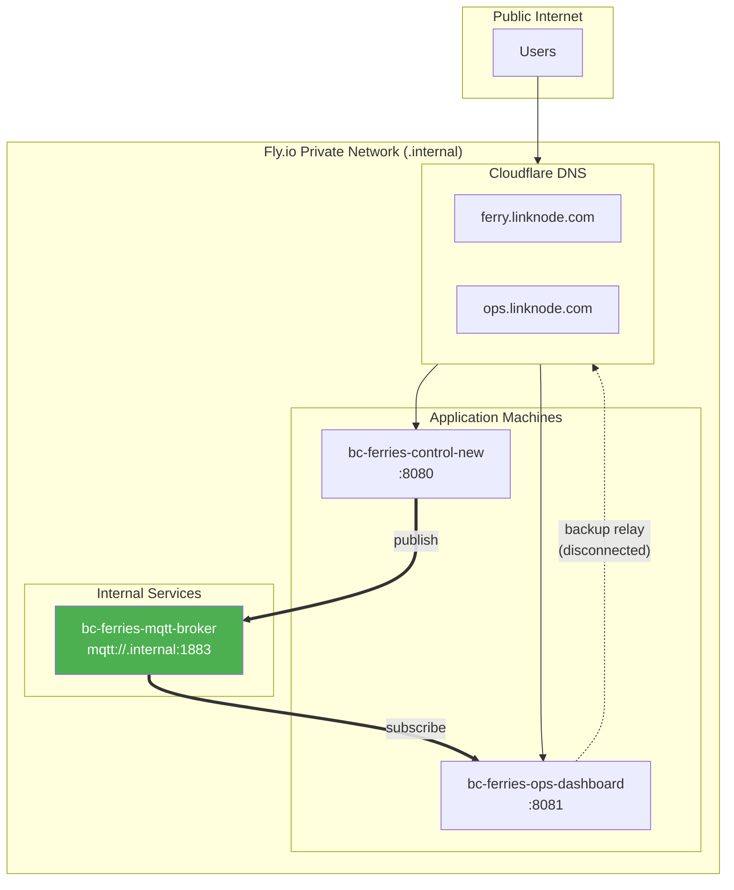

## Frontend Protocol Toggle Explained

The ferry dashboard (ferry.linknode.com) has a WebSocket/MQTT toggle switch. Here's what it **actually** does:

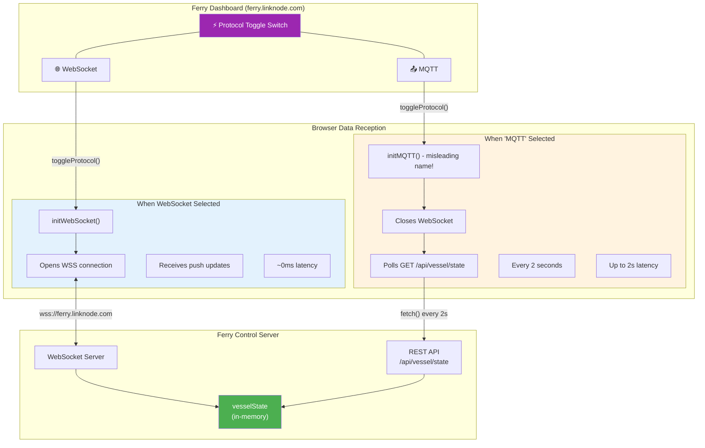

### Toggle Effect on Data Flow

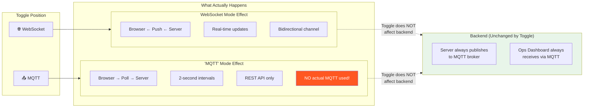

### Complete System View with Toggle

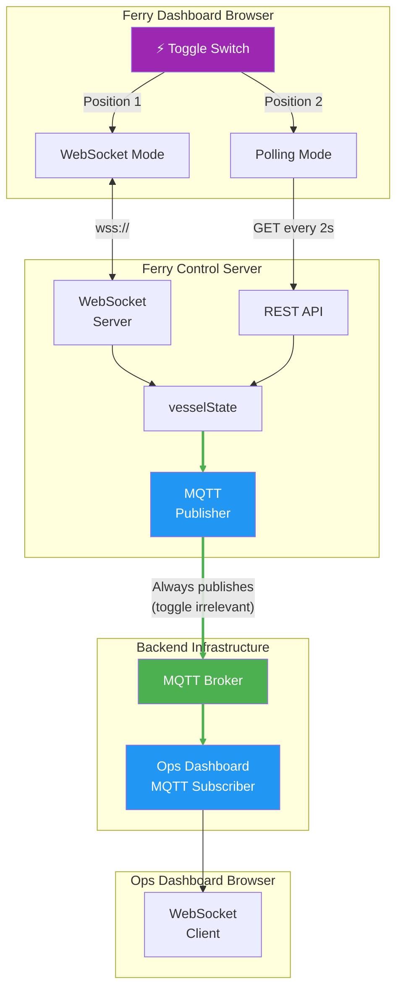

### Why the Misleading Name?

The toggle is labeled "MQTT" because:
- The **backend** publishes to MQTT (always, regardless of toggle)
- The **browser** never uses MQTT directly
- When you select "MQTT mode", you're really selecting "poll the REST API that reads MQTT-updated state"

| Toggle Position | Browser Behavior | Backend Behavior | Latency |
|----------------|------------------|------------------|---------|
| WebSocket | Opens WSS, receives pushes | Unchanged - publishes to MQTT | ~0ms |
| "MQTT" | Polls REST API every 2s | Unchanged - publishes to MQTT | Up to 2s |

> **Key Insight:** The toggle only affects how the **ferry dashboard browser** receives data. It has **zero effect** on the MQTT broker, ops dashboard, or any backend data routing.

## Message Flow: Complete Picture

### Control Input Round-Trip (Bidirectional Flow)

When a user adjusts a slider on the ferry dashboard, the text display doesn't update directly. Instead, it follows a **round-trip verification pattern**:

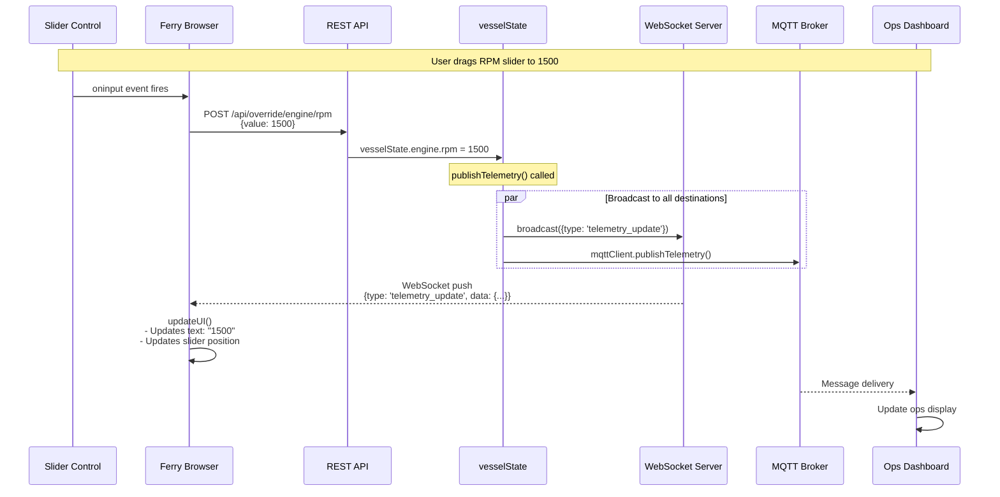

### Why Round-Trip Instead of Direct Update?

```mermaid
flowchart TB
    subgraph DirectUpdate["❌ Direct Update (NOT how it works)"]
        D1["User moves slider"]
        D2["JS updates text directly"]
        D3["Problem: Out of sync<br/>if server rejects value"]
        D1 --> D2 --> D3
    end

    subgraph RoundTrip["✅ Round-Trip (Actual Implementation)"]
        R1["User moves slider"]
        R2["POST to server"]
        R3["Server validates & updates state"]
        R4["Server broadcasts to ALL clients"]
        R5["Browser receives & updates UI"]
        R6["Guaranteed consistency"]
        R1 --> R2 --> R3 --> R4 --> R5 --> R6
    end

    style DirectUpdate fill:#FFEBEE
    style RoundTrip fill:#E8F5E9
```

### Complete Bidirectional Flow

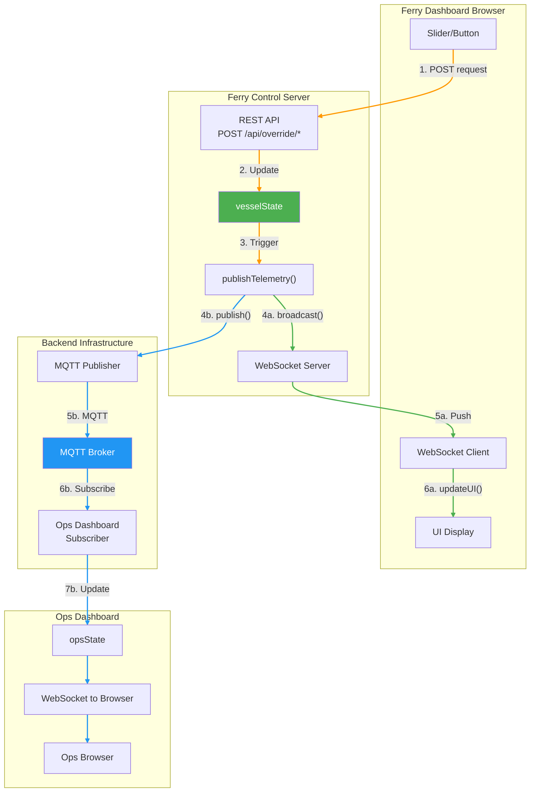

### Data Flow Summary

| Step | Component | Action | Protocol |
|------|-----------|--------|----------|
| 1 | Browser | User moves slider | - |
| 2 | Browser → Server | Send control command | HTTP POST |
| 3 | Server | Update vesselState | Internal |
| 4 | Server | Call publishTelemetry() | Internal |
| 5a | Server → Ferry Browser | Broadcast update | WebSocket |
| 5b | Server → MQTT Broker | Publish telemetry | MQTT |
| 6a | Ferry Browser | updateUI() - text + slider | JavaScript |
| 6b | MQTT Broker → Ops | Deliver message | MQTT |
| 7 | Ops Dashboard | Update display | WebSocket |

> **Key Insight:** The ferry dashboard text boxes update via **WebSocket round-trip**, not MQTT. The ferry browser does NOT subscribe to MQTT - only the ops-dashboard does. Both dashboards receive updates, but through different channels.

## Failure Modes & Recovery

### MQTT Client Recovery (ferry-control)

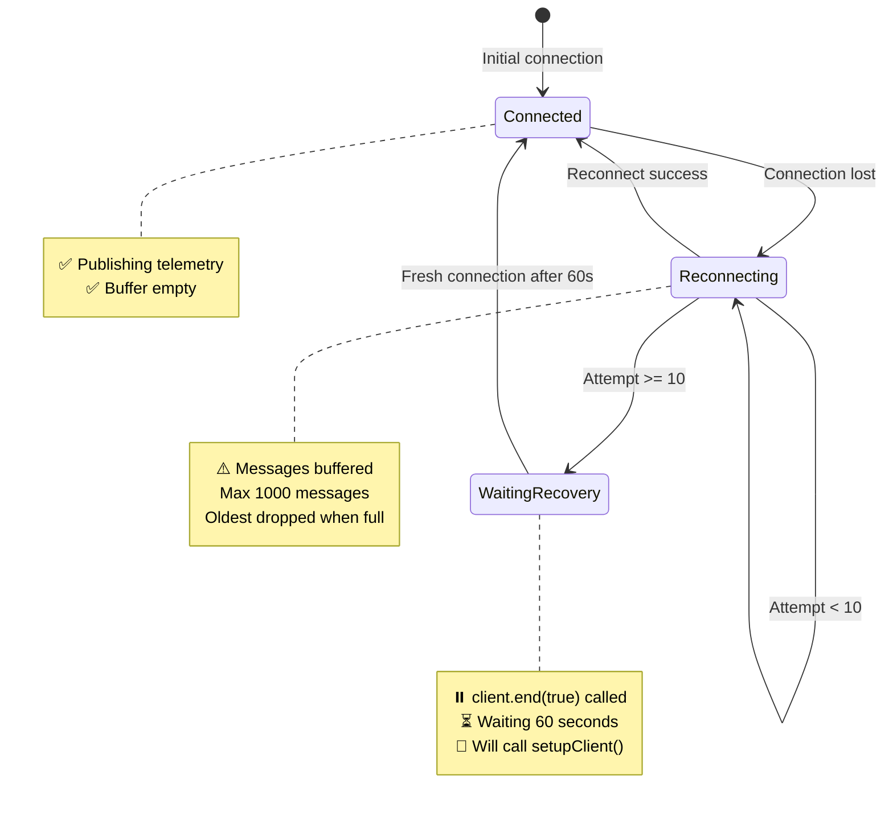

### Ops Dashboard WebSocket Relay Recovery

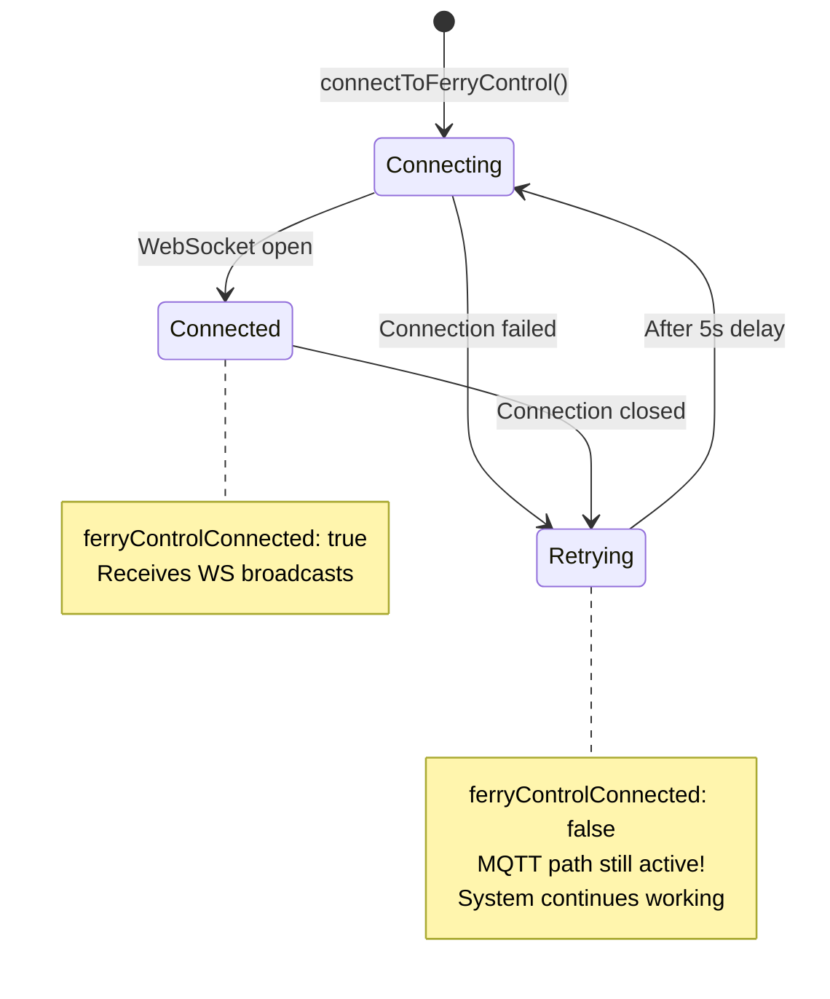

## Health Check Endpoints

### Ferry Control: `/health`

```json
{
  "status": "healthy",
  "timestamp": "2025-12-06T05:09:33.915Z",
  "vesselId": "island-class-001",
  "mqtt": {
    "connected": true,
    "broker": "mqtt://bc-ferries-mqtt-broker.internal:1883",
    "clientId": "bc-ferries-mqtt-...",
    "reconnectAttempts": 0,
    "bufferedMessages": 0,
    "lastHeartbeat": 1764997753448
  },
  "systems": {
    "engine": "operational",
    "power": "electric",
    "safety": "normal"
  }
}
```

### Ops Dashboard: `/health`

```json
{
  "status": "healthy",
  "timestamp": "2025-12-06T05:09:44.063Z",
  "connectedVessels": 1,
  "dashboardClients": 2,
  "ferryControlConnected": false
}
```

> **Note:** `ferryControlConnected: false` refers to the WebSocket relay path only. The MQTT path is working and delivering data.

## Message Formats

### Telemetry Message

```json
{
  "vesselId": "island-class-001",
  "timestamp": "2025-12-06T10:30:00.000Z",
  "messageId": "uuid-v4",
  "location": {
    "latitude": 48.6569,
    "longitude": -123.3933,
    "heading": 45
  },
  "engine": {
    "rpm": 1200,
    "temperature": 85,
    "fuelFlow": 120
  },
  "power": {
    "batterySOC": 85,
    "mode": "hybrid",
    "generatorLoad": 45
  },
  "safety": {
    "fireAlarm": false,
    "bilgeLevel": 15,
    "co2Level": 400
  },
  "navigation": {
    "speed": 12.5,
    "route": "SWB-TSA",
    "nextWaypoint": "Active Pass"
  }
}
```

### Emergency Message

```json
{
  "id": "island-class-001_fire_1701773400000",
  "vesselId": "island-class-001",
  "alertType": "fire",
  "severity": "critical",
  "emergency": true,
  "type": "fire",
  "timestamp": "2025-12-06T10:30:00.000Z",
  "message": "Fire alarm activated - engine power reduced",
  "location": {
    "latitude": 48.6569,
    "longitude": -123.3933
  },
  "response": {
    "required": true,
    "estimated_eta": 900
  }
}
```

## Summary

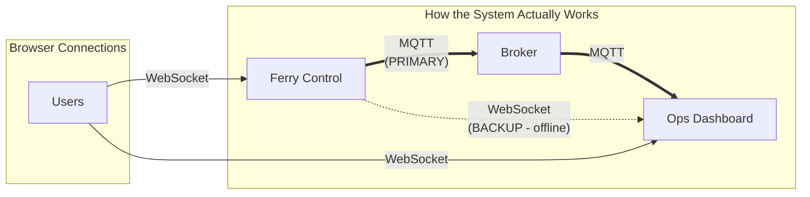

**Key Points:**

1. **MQTT is the primary path** - Both ferry-control and ops-dashboard connect to the internal Mosquitto broker
2. **WebSocket relay is backup** - The direct WebSocket connection from ops to ferry is currently disconnected, but the system works fine without it
3. **Frontend toggle is misleading** - The "MQTT" mode on the ferry dashboard is actually REST polling, not real MQTT
4. **Data flows correctly** - Ops dashboard logs show "Operational state from MQTT: ..." confirming MQTT delivery works
