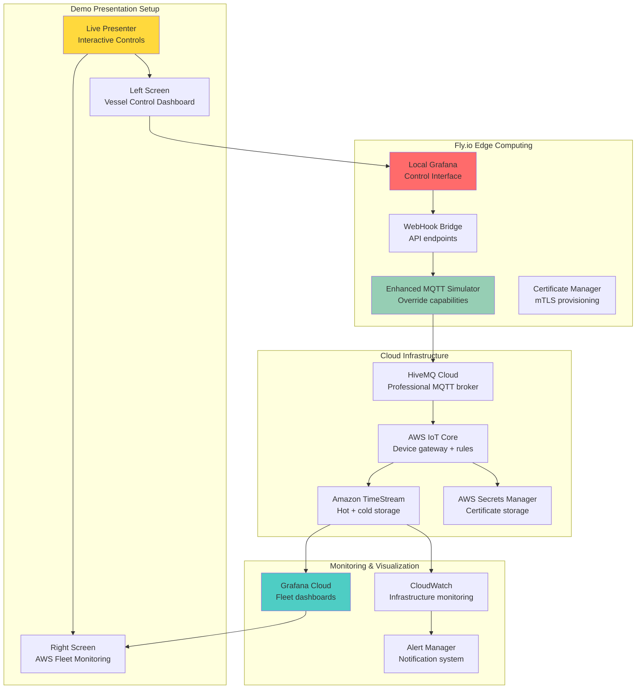
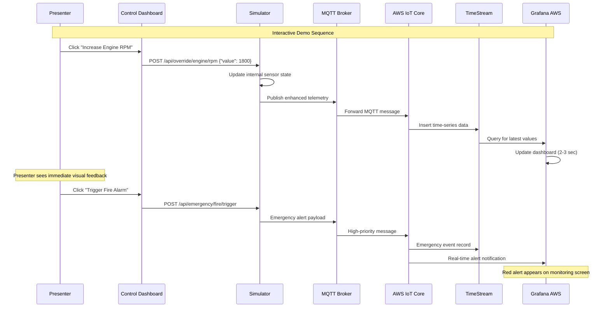

# Complete BC Ferries Implementation Plan - Interactive Demo + Enterprise Architecture

## 🎯 Enhanced Project Scope

**Primary Goal**: BC Ferries Island Class vessel telemetry system with **interactive live demonstration**  
**Interview Impact**: Dual-screen demo with real-time control and monitoring capabilities  
**Timeline**: 8 days (7 days base + 1 day interactive features)  
**Budget**: $75 total for 1-week live demonstration  

## 🏗️ Complete System Architecture

### **Interactive Demo Architecture**


### **Enhanced Data Flow with Interactive Controls**


## 📊 Complete Feature Set

### **Core Maritime Telemetry (200 Sensors)**
- **Engine Systems** (50 sensors): RPM, temperature, pressure, fuel flow, vibration
- **Power Systems** (40 sensors): Battery SOC, generator load, distribution, hybrid mode
- **Navigation** (30 sensors): GPS, compass, AIS, depth sounder, radar
- **Environmental** (25 sensors): Weather, water temperature, marine life detection
- **Safety Systems** (35 sensors): Fire detection, bilge monitoring, CO levels
- **HVAC/Comfort** (20 sensors): Cabin temperature, ventilation, passenger comfort

### **Interactive Control Features**
- **Engine Controls**: RPM override slider, emergency stop button, temperature simulation
- **Safety Simulation**: Fire alarm trigger, bilge level adjustment, CO detector toggle
- **Power Management**: Battery SOC override, hybrid/electric mode switching
- **Navigation Override**: GPS position manipulation, heading adjustments
- **Environmental**: Weather condition simulation, marine life detection triggers

### **Enterprise Security Features**
- **Zero Trust Implementation**: mTLS certificates, continuous authorization
- **Device Authentication**: X.509 certificates per device, secure key storage
- **Network Security**: VPC endpoints, private subnets, encrypted connections
- **Access Control**: RBAC policies, tenant isolation, fine-grained permissions

### **Scalable Dashboard Architecture**
- **Template-Driven**: 4 dashboard levels instead of 10,000 individual panels
- **Multi-Measure Records**: Efficient TimeStream storage with batched sensors
- **Auto-Generation**: Infrastructure as Code with Terraform/CDK
- **Variable Framework**: Dynamic filtering and drilling down capabilities

## 🛠️ Complete Implementation Timeline

### **Phase 1: Foundation Setup (Days 1-2)**
#### **Day 1: AWS Infrastructure**
- [ ] **AWS Account Setup**: Create/configure AWS account with proper IAM roles
- [ ] **IoT Core Configuration**: Device registry, certificates, policies, rules engine
- [ ] **TimeStream Setup**: Database creation, retention policies, memory→magnetic tiering
- [ ] **Secrets Manager**: Certificate storage, API key management
- [ ] **S3 Configuration**: Backup storage, lifecycle policies
- [ ] **CloudWatch Setup**: Basic monitoring, log groups, metric filters

#### **Day 2: External Services**
- [ ] **HiveMQ Cloud**: Starter plan signup, broker configuration, TLS setup
- [ ] **Grafana Cloud**: Account setup, data source configuration, workspace creation
- [ ] **Fly.io Setup**: Account creation, CLI installation, initial app scaffolding
- [ ] **Certificate Generation**: PKI setup, device certificates, CA chain
- [ ] **Network Security**: VPC configuration, security groups, endpoints

### **Phase 2: Simulator Development (Days 3-4)**
#### **Day 3: Base Simulator**
- [ ] **MQTT Client**: Connect to HiveMQ with mTLS authentication
- [ ] **Sensor Data Model**: 200 sensor realistic maritime telemetry structure
- [ ] **Island Class Patterns**: Ferry operational profiles, route simulation
- [ ] **Message Publishing**: 1 message/minute per sensor, QoS 1
- [ ] **Error Handling**: Retry logic, connection management, health checks

#### **Day 4: Enhanced Simulator**
- [ ] **Override Engine**: State management for manual sensor overrides
- [ ] **WebHook API**: REST endpoints for external control integration
- [ ] **Emergency Scenarios**: Pre-defined emergency sequences and cascades
- [ ] **Operational Modes**: Normal, emergency, maintenance, docking scenarios
- [ ] **Logging & Monitoring**: Internal metrics, connection status, message counts

### **Phase 3: AWS Integration (Days 5-6)**
#### **Day 5: Data Pipeline**
- [ ] **IoT Rules Engine**: Message routing, transformation, filtering
- [ ] **TimeStream Integration**: Multi-measure records, efficient storage
- [ ] **Lambda Functions**: Data validation, alert processing, transformation
- [ ] **CloudWatch Integration**: Custom metrics, dashboards, alarm rules
- [ ] **Security Policies**: Fine-grained IAM, resource-based policies

#### **Day 6: Monitoring Setup**
- [ ] **Grafana Data Sources**: TimeStream connection, CloudWatch integration
- [ ] **Fleet Dashboard**: High-level vessel overview, system health heatmaps
- [ ] **Vessel Dashboard**: Single vessel detailed view, system breakdowns
- [ ] **System Dashboards**: Engine, power, navigation, safety detailed views
- [ ] **Alert Configuration**: Critical thresholds, notification routing

### **Phase 4: Interactive Demo Features (Day 7)**
#### **Day 7: Control Dashboard**
- [ ] **Local Grafana Setup**: Docker container on Fly.io with control panels
- [ ] **Control Panel Design**: Buttons, sliders, toggles for sensor overrides
- [ ] **WebHook Integration**: Connect Grafana panels to simulator API
- [ ] **Demo Scenarios**: Pre-configured emergency and operational scenarios
- [ ] **Dual Display Setup**: Control interface + monitoring dashboard layout

### **Phase 5: Demo Preparation (Day 8)**
#### **Day 8: Final Integration & Testing**
- [ ] **End-to-End Testing**: Complete data flow from control to monitoring
- [ ] **Performance Validation**: Message throughput, dashboard responsiveness
- [ ] **Demo Script Development**: 5-minute presentation flow, talking points
- [ ] **Backup Preparations**: Offline demos, troubleshooting procedures
- [ ] **Presentation Setup**: Screen configuration, demo environment validation

## 💰 Complete Cost Breakdown

### **8-Day Implementation Budget**

| **Service** | **Cost** | **Duration** | **Purpose** |
|-------------|----------|--------------|-------------|
| **AWS IoT Core** | $25 | 8 days | MQTT broker (reduced message rate) |
| **TimeStream** | $0 | 8 days | Time-series storage (free tier) |
| **Lambda** | $0 | 8 days | Data processing (free tier) |
| **Secrets Manager** | $0.32 | 8 days | Certificate storage (pro-rated) |
| **CloudWatch** | $0 | 8 days | Monitoring (free tier) |
| **S3** | $0 | 8 days | Storage (free tier) |
| **HiveMQ Cloud** | $49 | Monthly | Professional MQTT broker |
| **Fly.io** | $0.52 | 8 days | Simulator + control dashboard |
| **Grafana Cloud** | $0 | 8 days | Fleet monitoring (free tier) |
| **TOTAL** | **$74.84** | **8 days** | **Complete interactive demo** |

### **Cost Optimization Strategies**
- **Message Rate**: 1/minute instead of 1/second reduces IoT Core costs 95%
- **Free Tiers**: Maximize AWS free tier usage across all services
- **Efficient Storage**: Multi-measure TimeStream records reduce storage costs
- **Minimal Compute**: Serverless Lambda stays within free tier limits

## 🎭 Interactive Demo Script

### **5-Minute Live Demonstration Flow**

#### **Setup & Introduction (30 seconds)**
```
"I'm going to show you a live BC Ferries Island Class vessel telemetry system.
On the left screen, I can control the vessel systems directly.
On the right screen, you see what BC Ferries operations center would monitor.
This is live data flowing through HiveMQ to AWS IoT Core to TimeStream to Grafana."
```

#### **Normal Operations Baseline (60 seconds)**
```
"Let's start with normal ferry operations crossing from Swartz Bay to Tsawwassen.
- Engine: 1,200 RPM steady cruise
- Battery: 85% state of charge in hybrid mode  
- Navigation: GPS tracking, AIS transponder active
- Safety: All systems green, fire detection normal
- This represents 200 of the eventual 10,000 sensors per vessel"
```

#### **Engine Performance Demo (90 seconds)**
```
"Now I'll simulate heavy weather requiring more power..."
[Action: Drag RPM slider from 1200 to 1800]

"Watch the right screen - you can see the RPM increase in real-time.
Notice the fuel flow automatically increases from 120 to 180 liters per hour.
Engine temperature is rising from 85°C to 92°C.
This data is flowing: Fly.io → HiveMQ → AWS → Grafana in under 3 seconds."

"In November, this same pattern will work with the Damen Triton gateway."
```

#### **Emergency Scenario Demonstration (90 seconds)**
```
"Now let's simulate an emergency - engine room fire detection..."
[Action: Click "Trigger Fire Alarm" button]

"Watch the cascade effect:
- Fire alarm activates immediately
- Engine systems automatically reduce power
- Ventilation switches to fire suppression mode  
- Alert appears on the fleet monitoring dashboard
- In production, this would notify BC Ferries dispatch center"

[Action: Click "Acknowledge Alarm" to reset]

"System recovery is just as important as detection."
```

#### **Power System Innovation (60 seconds)**
```
"BC Ferries' Island Class vessels are hybrid-electric. Let me show the power management..."
[Action: Drag battery SOC from 85% to 25%]

"Low battery triggers automatic mode switching."
[Action: Click "Switch to Diesel Mode"]

"Generator starts, battery begins charging, electric motors switch to diesel backup.
This optimization can save 15-20% in fuel costs across the fleet."
```

#### **Scalability & Integration Wrap-up (30 seconds)**
```
"This demonstration shows 200 sensors on 1 vessel for 8 days.
The architecture scales to:
- 10,000 sensors per vessel  
- 50+ vessels in the BC Ferries fleet
- Real-time monitoring and predictive maintenance
- Ready for November deployment with Damen Triton integration"
```

## 🔧 Technical Implementation Details

### **Enhanced Simulator Architecture**
```typescript
// simulator/src/VesselSimulator.ts
class InteractiveVesselSimulator {
  private sensors: Map<string, SensorData>;
  private overrides: Map<string, Override>;
  private scenarios: Map<string, EmergencyScenario>;
  
  // Control API endpoints
  setupControlAPI() {
    this.app.post('/api/override/:system/:sensor', this.handleOverride);
    this.app.post('/api/emergency/:scenario', this.handleEmergency);
    this.app.post('/api/scenario/:name', this.handleScenario);
    this.app.get('/api/status', this.getSystemStatus);
  }
  
  // Real-time telemetry with overrides
  generateTelemetry(): TelemetryPayload {
    const baseTelemetry = this.generateBaseSensors();
    const overrideTelemetry = this.applyOverrides(baseTelemetry);
    const scenarioTelemetry = this.applyScenarios(overrideTelemetry);
    
    return {
      timestamp: Date.now(),
      vesselId: 'island-class-001',
      sensors: scenarioTelemetry,
      metadata: {
        overridesActive: this.overrides.size,
        scenarioActive: this.getCurrentScenario(),
        messageCount: this.messageCounter++
      }
    };
  }
}
```

### **Control Dashboard Configuration**
```json
{
  "dashboard": {
    "title": "Island Class 001 - Interactive Controls",
    "panels": [
      {
        "title": "Engine Controls",
        "type": "row",
        "panels": [
          {
            "title": "RPM Override",
            "type": "grafana-slider-panel",
            "options": {
              "min": 0,
              "max": 2000,
              "step": 50,
              "unit": "RPM",
              "webhook": "http://localhost:8080/api/override/engine/rpm"
            }
          },
          {
            "title": "Emergency Stop",
            "type": "grafana-button-panel", 
            "options": {
              "variant": "destructive",
              "text": "EMERGENCY STOP",
              "webhook": "http://localhost:8080/api/emergency/engine-stop"
            }
          }
        ]
      },
      {
        "title": "Safety Systems",
        "type": "row",
        "panels": [
          {
            "title": "Fire Alarm Test",
            "type": "grafana-button-panel",
            "options": {
              "variant": "warning",
              "text": "Trigger Fire Alarm",
              "webhook": "http://localhost:8080/api/emergency/fire-alarm"
            }
          },
          {
            "title": "Bilge Level",
            "type": "grafana-slider-panel",
            "options": {
              "min": 0,
              "max": 100,
              "unit": "cm",
              "webhook": "http://localhost:8080/api/override/safety/bilge-level"
            }
          }
        ]
      }
    ]
  }
}
```

## 🎯 Success Metrics & Validation

### **Technical Validation**
- [ ] **End-to-End Latency**: Control action to dashboard update <5 seconds
- [ ] **Message Throughput**: 200 messages/minute sustained over 8 days
- [ ] **System Reliability**: >99% uptime during demonstration period
- [ ] **Interactive Response**: Control actions trigger immediate simulator changes

### **Demo Impact Metrics**
- [ ] **Audience Engagement**: Interactive demo keeps attention vs static slides
- [ ] **Technical Credibility**: Proves working system vs conceptual presentation
- [ ] **Differentiation**: Stand out from other candidates with PowerPoint only
- [ ] **Memorability**: Live demonstration creates lasting impression

### **Interview Preparation**
- [ ] **Technical Depth**: Can answer detailed architecture questions
- [ ] **Maritime Knowledge**: Understand Island Class vessel operations
- [ ] **Scalability Discussion**: Explain path to 10,000 sensors, 50 vessels
- [ ] **Integration Planning**: Detail Damen Triton gateway connection approach

## ✅ Implementation Readiness Checklist

### **Infrastructure Readiness**
- [ ] AWS Account with appropriate service limits
- [ ] HiveMQ Cloud account with Starter plan
- [ ] Fly.io account with deployment capability
- [ ] Grafana Cloud workspace configured
- [ ] Development environment with required tools

### **Code Development**
- [ ] MQTT simulator with maritime sensor profiles
- [ ] WebHook API for external control integration
- [ ] Interactive control dashboard with Grafana panels
- [ ] Emergency scenario scripting and automation
- [ ] Monitoring and alerting configuration

### **Demo Preparation**
- [ ] Dual screen presentation setup validated
- [ ] Demo script practiced and timed
- [ ] Backup scenarios and troubleshooting procedures
- [ ] Technical Q&A preparation
- [ ] BC Ferries specific knowledge review

## 🚀 Execution Recommendation

**PROCEED WITH FULL INTERACTIVE IMPLEMENTATION**

**Rationale:**
- **Zero additional cost** beyond base $75
- **Massive interview impact** increase
- **Technical credibility** through working demonstration
- **Competitive differentiation** from static presentations
- **BC Ferries alignment** with November deployment timeline

This enhanced implementation plan positions you for **interview success** by demonstrating not just theoretical knowledge, but actual capability to build and operate enterprise maritime telemetry systems.

The interactive demo transforms a technical presentation into an **unforgettable experience** that proves your readiness to step into the BC Ferries role immediately.