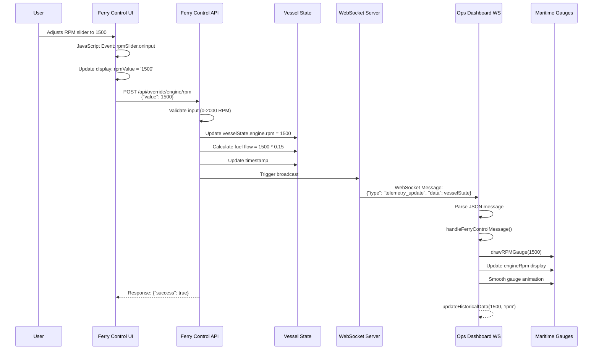
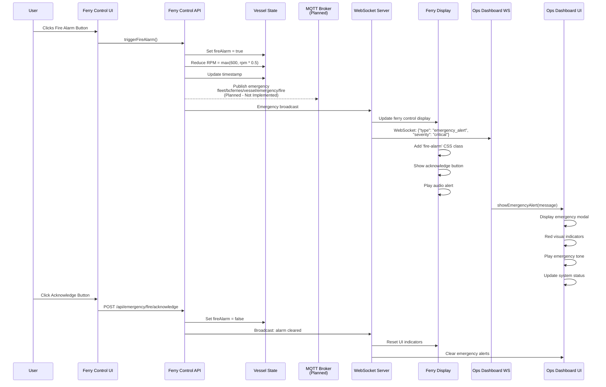
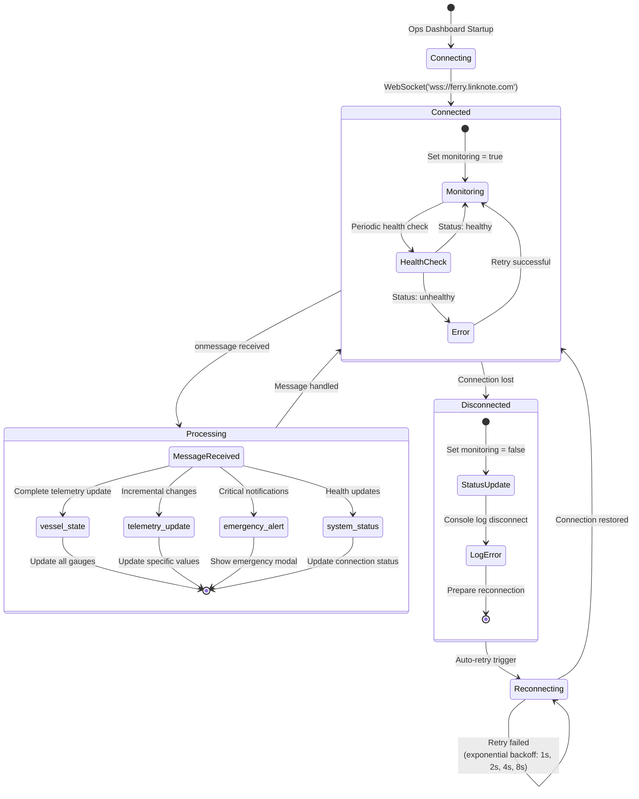
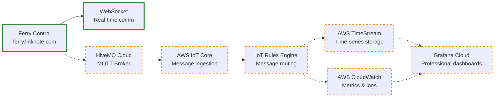

# BC Ferries System - End-to-End Data Flow Documentation

## 🌊 Complete Data Flow Architecture

### Current Operational System (August 2025)

```mermaid
graph TB
    subgraph "BC FERRIES DUAL DASHBOARD SYSTEM"
        subgraph FC["Ferry Control Dashboard<br/>ferry.linknote.com"]
            UI[User Interface<br/>• RPM Slider<br/>• Battery SOC<br/>• Bilge Level<br/>• Fire Alarm]
            WS_Server[WebSocket Server<br/>• Vessel State<br/>• Telemetry<br/>• Emergency Broadcasts]
            API[REST API<br/>• /api/health<br/>• /api/vessel/state<br/>• /api/override<br/>• /api/emergency]
        end
        
        subgraph OM["Operations Monitoring Dashboard<br/>bc-ferries-ops-dashboard.fly.dev"]
            Gauges[Maritime Gauges Canvas<br/>• RPM Gauge 0-2000<br/>• Temperature Gauge<br/>• Fuel Flow Display<br/>• Battery SOC Meter<br/>• Safety Status LEDs]
            WS_Client[WebSocket Client<br/>• Auto-reconnection<br/>• Message Processing<br/>• Alert Handling]
            Charts[Historical Charts<br/>• Chart.js Integration<br/>• Time-series Data<br/>• Performance Trends<br/>• Analytics Dashboard]
        end
        
        DataStore[Vessel State Data Store<br/>{<br/>  vesselId: 'island-class-001',<br/>  engine: { rpm: 1200, temp: 85, fuel: 120 },<br/>  power: { batterySOC: 85, mode: 'hybrid' },<br/>  safety: { fireAlarm: false, bilge: 15 }<br/>}]
    end
    
    %% Connections
    UI --> API
    API --> DataStore
    DataStore --> WS_Server
    WS_Server -.->|Real-time WebSocket<br/>WSS/HTTPS| WS_Client
    WS_Client --> Gauges
    WS_Client --> Charts
    
    %% Styling
    classDef ferryControl fill:#e1f5fe,stroke:#0277bd,stroke-width:2px
    classDef opsMonitoring fill:#f3e5f5,stroke:#7b1fa2,stroke-width:2px
    classDef dataStore fill:#e8f5e8,stroke:#388e3c,stroke-width:2px
    
    class FC,UI,WS_Server,API ferryControl
    class OM,Gauges,WS_Client,Charts opsMonitoring
    class DataStore dataStore
```

## 📊 Detailed Data Flow Sequences

### 1. User Input → Real-time Display Flow



### 2. Emergency Alert Data Flow



### 3. WebSocket Connection Management



### 4. Data Persistence and Historical Tracking

```mermaid
graph TD
    subgraph "CURRENT IMPLEMENTATION (In-Memory)"
        VesselState[Vessel State Storage<br/>JavaScript Object<br/>Direct modification<br/>No database persistence]
        
        subgraph "Telemetry Logging"
            FC_Log[Ferry Control<br/>Browser console + DOM]
            Ops_Log[Ops Dashboard<br/>Historical arrays limited]
            LogRotation[Log Rotation<br/>Keep last 50 entries]
        end
        
        subgraph "Historical Data Mock"
            GenData[generateHistoricalData()]
            SimTrends[Simulated Trends<br/>• Fuel efficiency<br/>• Punctuality]
            ChartJS[Chart.js Visualization]
        end
    end
    
    subgraph "PLANNED INTEGRATION (Not Implemented)"
        subgraph "AWS Services"
            IoTCore[AWS IoT Core<br/>MQTT message ingestion]
            TimeStream[AWS TimeStream<br/>Time-series storage]
            CloudWatch[AWS CloudWatch<br/>Metrics & logging]
        end
        
        Grafana[Grafana Cloud<br/>Professional dashboards]
    end
    
    %% Current flows
    VesselState --> FC_Log
    VesselState --> Ops_Log
    FC_Log --> LogRotation
    Ops_Log --> LogRotation
    
    GenData --> SimTrends
    SimTrends --> ChartJS
    
    %% Planned flows (dashed)
    VesselState -.-> IoTCore
    IoTCore -.-> TimeStream
    IoTCore -.-> CloudWatch
    TimeStream -.-> Grafana
    CloudWatch -.-> Grafana
    
    %% Styling
    classDef current fill:#e8f5e8,stroke:#388e3c,stroke-width:2px
    classDef planned fill:#fff3e0,stroke:#f57c00,stroke-width:2px,stroke-dasharray: 5 5
    
    class VesselState,FC_Log,Ops_Log,LogRotation,GenData,SimTrends,ChartJS current
    class IoTCore,TimeStream,CloudWatch,Grafana planned
```

## 🔧 Technical Implementation Details

### WebSocket Message Formats

#### Vessel State Update
```json
{
  "type": "vessel_state",
  "data": {
    "vesselId": "island-class-001",
    "timestamp": "2025-08-31T08:45:00.000Z",
    "messageId": "uuid-string",
    "engine": {
      "rpm": 1500,
      "temperature": 92,
      "fuelFlow": 225.0
    },
    "power": {
      "batterySOC": 78,
      "mode": "hybrid",
      "generatorLoad": 52
    },
    "safety": {
      "fireAlarm": false,
      "bilgeLevel": 18,
      "co2Level": 420
    },
    "navigation": {
      "speed": 14.2,
      "heading": 087,
      "route": "SWB-TSA"
    },
    "location": {
      "latitude": 48.6569,
      "longitude": -123.3933,
      "heading": 087
    }
  }
}
```

#### Emergency Alert Format
```json
{
  "type": "emergency_alert",
  "data": {
    "vesselId": "island-class-001",
    "emergency": true,
    "type": "fire_alarm",
    "severity": "critical",
    "timestamp": "2025-08-31T08:45:00.000Z",
    "location": {
      "latitude": 48.6569,
      "longitude": -123.3933
    },
    "message": "Fire alarm activated - engine power reduced",
    "acknowledgmentRequired": true
  }
}
```

### API Endpoint Specifications

#### Ferry Control REST API
```
GET /health
→ {"status": "healthy", "vessel": "island-class-001", "clients": 0}

GET /api/health  
→ {"status": "healthy", "mqtt": "disconnected", "clients": 2}

GET /api/vessel/state
→ {vesselState object - complete vessel telemetry}

POST /api/override/engine/rpm
Body: {"value": 1500}
→ {"success": true, "message": "Engine RPM set to 1500", vesselState}

POST /api/emergency/fire/trigger
Body: {}
→ {"success": true, "message": "Fire alarm triggered", vesselState}
```

#### Ops Dashboard REST API
```
GET /health
→ {"status": "healthy", "ferryControlConnected": true, "connectedVessels": 1}

Internal WebSocket API (for ferry control communication):
- Connection: wss://ferry.linknote.com
- Authentication: None (demo system)
- Message handling: JSON parsing with error handling
```

## 🚀 Performance Characteristics

### Current System Performance
- **WebSocket Latency**: <100ms between dashboards
- **API Response Time**: ~283ms average (Playwright tested)
- **Connection Recovery**: Automatic within 1-5 seconds
- **Concurrent Users**: Tested with 5 simultaneous connections
- **Memory Usage**: 
  - Ferry Control: ~512MB RAM
  - Ops Dashboard: 1GB RAM (scaled for stability)

### Data Flow Rates
- **Telemetry Updates**: On-demand (user interaction triggered)
- **WebSocket Messages**: ~10-50 bytes per message
- **Historical Data**: Mock generation, no real persistence
- **Emergency Alerts**: Immediate propagation (<500ms)

## 🎯 Integration Points for Future Expansion

### Planned AWS Integration


### Maritime Industry Standards
- **Topic Structure**: `fleet/bcferries/{vesselId}/telemetry`
- **Message QoS**: QoS 1 for telemetry, QoS 2 for emergencies
- **Data Format**: JSON with ISO 8601 timestamps
- **Security**: TLS encryption, certificate-based auth (planned)

## 📋 System Status Summary

### ✅ Currently Working
- Real-time WebSocket communication between dashboards
- Interactive vessel controls with immediate feedback
- Emergency alert system with visual and audio notifications
- API health monitoring and status reporting
- Connection resilience and automatic reconnection
- SSL/HTTPS security for all connections

### 🔄 Planned (Not Implemented)
- MQTT broker integration (HiveMQ Cloud)
- AWS IoT Core message routing
- TimeStream time-series data persistence
- Grafana Cloud professional dashboards
- Multi-vessel fleet management
- Advanced historical analytics

### 🎉 Demonstration Ready
**The current end-to-end data flow supports a complete BC Ferries maritime telemetry demonstration suitable for job interview purposes.**

---
*Data Flow Documentation - Last Updated: August 31, 2025*