# Interactive Grafana Demo - Vessel Control + AWS Monitoring

## 🎯 Enhanced Demo Concept

**Dual Dashboard Architecture**:
- **Vessel Control Dashboard** (Fly.io local): Interactive controls to override sensors
- **Fleet Monitoring Dashboard** (AWS/Grafana Cloud): Real-time display of telemetry

This creates a **compelling live demonstration** where you can trigger events and immediately see the response in the AWS monitoring system.

## 🏗️ Interactive Demo Architecture

```mermaid
graph TB
    subgraph "Fly.io Edge (Vessel Simulator)"
        CTRL[Grafana Control Dashboard<br/>Local Port 3000]
        SIM[MQTT Simulator<br/>200 sensors]
        OVER[Override Engine<br/>Manual controls]
    end
    
    subgraph "Demo Interaction"
        USER[Demo Presenter]
        ACTIONS[Live Actions:<br/>• Engine RPM override<br/>• Fire alarm trigger<br/>• Battery level change]
    end
    
    subgraph "AWS Cloud (Fleet Monitoring)"
        IOT[AWS IoT Core<br/>MQTT ingestion]
        TS[TimeStream<br/>Real-time storage]
        GRAF_AWS[Grafana Cloud<br/>Fleet dashboard]
        ALERTS[CloudWatch<br/>Alert rules]
    end
    
    USER --> CTRL
    CTRL --> OVER
    OVER --> SIM
    SIM --> IOT
    IOT --> TS
    TS --> GRAF_AWS
    IOT --> ALERTS
    
    USER --> ACTIONS
    ACTIONS --> CTRL
    
    style CTRL fill:#ff6b6b
    style GRAF_AWS fill:#4ecdc4
    style ACTIONS fill:#ffd93d
```



## 📊 Control Dashboard Design

### **Vessel Control Interface (Fly.io Grafana)**

#### **Engine Controls Panel**
```json
{
  "title": "Engine Override Controls",
  "panels": [
    {
      "type": "stat",
      "title": "Current RPM",
      "targets": [{"expr": "current_engine_rpm"}]
    },
    {
      "type": "slider-panel",
      "title": "RPM Override",
      "options": {
        "min": 0,
        "max": 2000,
        "step": 50,
        "webhook": "http://localhost:8080/api/override/engine/rpm"
      }
    },
    {
      "type": "button-panel",
      "title": "Engine Emergency Stop",
      "options": {
        "variant": "destructive",
        "webhook": "http://localhost:8080/api/emergency/engine/stop"
      }
    }
  ]
}
```

#### **Safety System Controls**
```json
{
  "title": "Safety System Simulation",
  "panels": [
    {
      "type": "button-panel",
      "title": "Trigger Fire Alarm",
      "options": {
        "variant": "destructive",
        "webhook": "http://localhost:8080/api/safety/fire/trigger"
      }
    },
    {
      "type": "slider-panel", 
      "title": "Bilge Water Level",
      "options": {
        "min": 0,
        "max": 100,
        "unit": "cm",
        "webhook": "http://localhost:8080/api/safety/bilge/level"
      }
    },
    {
      "type": "switch-panel",
      "title": "CO Detector Status",
      "options": {
        "webhook": "http://localhost:8080/api/safety/co/status"
      }
    }
  ]
}
```

#### **Power System Controls**
```json
{
  "title": "Hybrid Power Controls",
  "panels": [
    {
      "type": "slider-panel",
      "title": "Battery SOC Override",
      "options": {
        "min": 0,
        "max": 100,
        "unit": "%",
        "webhook": "http://localhost:8080/api/power/battery/soc"
      }
    },
    {
      "type": "button-panel",
      "title": "Switch to Electric Mode",
      "options": {
        "webhook": "http://localhost:8080/api/power/mode/electric"
      }
    },
    {
      "type": "button-panel",
      "title": "Switch to Hybrid Mode", 
      "options": {
        "webhook": "http://localhost:8080/api/power/mode/hybrid"
      }
    }
  ]
}
```

## 💻 Implementation Components

### **1. Enhanced MQTT Simulator (Node.js/Python)**

```typescript
// simulator/src/controllers/overrideController.ts
interface SensorOverride {
  sensorId: string;
  value: number | string | boolean;
  duration?: number; // seconds
  resetAfter?: boolean;
}

class VesselSimulator {
  private overrides: Map<string, SensorOverride> = new Map();
  private baseSensors: SensorData;
  
  // API endpoints for Grafana webhooks
  setupOverrideAPI() {
    this.app.post('/api/override/engine/rpm', (req, res) => {
      const { value } = req.body;
      this.setOverride('main_engine_rpm', value, 60); // 60 second override
      this.publishTelemetry();
      res.json({ success: true, message: `RPM set to ${value}` });
    });
    
    this.app.post('/api/emergency/engine/stop', (req, res) => {
      this.setOverride('main_engine_rpm', 0, 300); // 5 minute emergency stop
      this.setOverride('engine_status', 'EMERGENCY_STOP', 300);
      this.publishTelemetry();
      res.json({ success: true, message: 'Emergency stop activated' });
    });
    
    this.app.post('/api/safety/fire/trigger', (req, res) => {
      this.setOverride('fire_detector_engine_room', 'FIRE_DETECTED', 120);
      this.setOverride('fire_alarm_status', 'ACTIVE', 120);
      this.publishTelemetry();
      res.json({ success: true, message: 'Fire alarm triggered' });
    });
  }
  
  generateTelemetryWithOverrides(): TelemetryPayload {
    const baseTelemetry = this.generateBaseTelemetry();
    
    // Apply active overrides
    for (const [sensorId, override] of this.overrides) {
      if (baseTelemetry.sensors[sensorId]) {
        baseTelemetry.sensors[sensorId].value = override.value;
        baseTelemetry.sensors[sensorId].override = true;
      }
    }
    
    return baseTelemetry;
  }
}
```

### **2. Grafana Control Dashboard Configuration**

```typescript
// grafana-config/control-dashboard.json
{
  "dashboard": {
    "title": "Island Class Vessel 001 - Control Interface",
    "tags": ["vessel-control", "bc-ferries", "demo"],
    "panels": [
      {
        "title": "Live Demo Controls",
        "type": "row",
        "panels": [
          {
            "title": "Engine RPM Control",
            "type": "grafana-polystat-panel",
            "targets": [
              {
                "queryType": "",
                "rawSql": "SELECT time, rpm FROM vessel_sensors WHERE sensor_id='main_engine_rpm' ORDER BY time DESC LIMIT 1"
              }
            ],
            "options": {
              "polystat": {
                "animationSpeed": 2500,
                "clickThrough": "http://localhost:8080/api/override/engine/rpm"
              }
            }
          }
        ]
      }
    ]
  }
}
```

### **3. WebHook Integration Bridge**

```python
# webhook-bridge/app.py
from flask import Flask, request, jsonify
import paho.mqtt.client as mqtt
import json
import time

app = Flask(__name__)
mqtt_client = mqtt.Client()

@app.route('/api/override/<system>/<sensor>', methods=['POST'])
def handle_override(system, sensor):
    data = request.get_json()
    
    # Create override message
    override_msg = {
        "timestamp": int(time.time() * 1000),
        "vesselId": "island-class-001",
        "system": system,
        "sensor": sensor,
        "override": True,
        "value": data.get('value'),
        "duration": data.get('duration', 60)
    }
    
    # Publish to MQTT
    topic = f"fleet/bcferries/island-class-001/{system}/{sensor}/override"
    mqtt_client.publish(topic, json.dumps(override_msg))
    
    return jsonify({
        "success": True,
        "message": f"Override applied to {system}.{sensor}",
        "value": data.get('value')
    })

@app.route('/api/emergency/<system>/<action>', methods=['POST'])
def handle_emergency(system, action):
    # Emergency scenarios with immediate MQTT publishing
    emergency_msg = {
        "timestamp": int(time.time() * 1000),
        "vesselId": "island-class-001", 
        "emergency": True,
        "system": system,
        "action": action,
        "severity": "HIGH"
    }
    
    topic = f"fleet/bcferries/island-class-001/emergency/{system}/{action}"
    mqtt_client.publish(topic, json.dumps(emergency_msg))
    
    return jsonify({"success": True, "emergency": f"{system} {action} triggered"})
```

## 🎭 Interactive Demo Script

### **5-Minute Live Demo Sequence**

#### **Setup (30 seconds)**
- **Show both screens**: Control dashboard (left) + AWS monitoring (right)
- **Explain**: "Left screen controls the vessel, right screen shows what BC Ferries operations would see"

#### **Normal Operations (60 seconds)**
- **Show baseline**: All systems normal, steady RPM, battery charging
- **Highlight**: Real-time data flowing from simulator to AWS TimeStream to Grafana

#### **Engine Performance Demo (90 seconds)**
1. **Increase RPM**: Drag slider from 1200 → 1800 RPM
2. **Immediate Response**: AWS dashboard shows RPM spike within 2-3 seconds
3. **Related Effects**: Fuel flow increases, temperature rises
4. **Commentary**: "This simulates heavy weather or ferry loading"

#### **Emergency Scenario (90 seconds)**
1. **Fire Alarm Trigger**: Click "Trigger Fire Alarm" button
2. **Cascading Alerts**: AWS dashboard shows:
   - Fire detector status change
   - Automatic engine shutdown sequence
   - Emergency notifications
3. **Recovery**: Show alarm acknowledgment and system reset

#### **Power System Demo (60 seconds)**
1. **Battery Override**: Simulate low battery (80% → 20%)
2. **Mode Switch**: Change from electric to hybrid mode
3. **Impact Visualization**: Generator starts, power distribution changes

#### **Wrap-up (30 seconds)**
- **Scalability**: "This same pattern works for 10,000 sensors across 50 vessels"
- **Integration**: "Ready for Damen Triton gateway connection in November"

## 💰 Additional Cost for Interactive Demo

### **Enhanced Components**

| **Component** | **Additional Cost** | **Benefit** |
|---------------|-------------------|-------------|
| **Local Grafana** | $0 | Docker container on Fly.io |
| **WebHook Bridge** | $0 | Simple Flask/Express API |
| **Enhanced Simulator** | $0 | Code enhancement only |
| **Demo Scripting** | $0 | Preparation time |
| **TOTAL EXTRA** | **$0** | **Pure impact enhancement** |

### **Same Base Cost: $75**
- All additional functionality runs within existing Fly.io instance
- No new services required
- Just enhanced application logic

## 🎯 Demo Impact Enhancement

### **Without Interactive Controls**
- Static dashboard showing pre-generated data
- "Trust me, this works" approach
- Limited engagement

### **With Interactive Controls** 
- **Live manipulation** of vessel systems during presentation
- **Immediate visual feedback** on monitoring dashboards  
- **Proof of real-time capability** not just canned demos
- **Memorable experience** for BC Ferries evaluators
- **Technical confidence** demonstration

## ✅ Implementation Feasibility

### **High Feasibility Because:**
1. **Grafana Supports**: Button panels, slider panels, webhook integrations
2. **Simple API**: REST endpoints to modify simulator behavior
3. **MQTT Integration**: Existing infrastructure handles override messages  
4. **Real-time Updates**: Current TimeStream → Grafana flow unchanged
5. **Single Fly.io App**: Can run both simulator and control interface

### **Technical Requirements:**
- **Grafana Plugins**: Button Panel, Slider Panel (free)
- **Webhook Bridge**: Simple HTTP API (50 lines of code)
- **Override Logic**: Enhanced simulator state management
- **Dual Display**: Laptop + external monitor for presentation

## 🚀 Recommended Implementation

**YES - Absolutely add the interactive controls!**

**Benefits:**
- **Zero additional cost** ($75 remains the same)
- **Massive impact increase** for interview demonstration  
- **Proof of technical capability** beyond slides
- **Memorable presentation** that stands out
- **Real-time system demonstration** not just static dashboards

**Timeline:** Add 1 day to implementation (Day 8) for interactive features

This transforms a good demo into an **unforgettable technical demonstration** that proves your capability to build real maritime telemetry solutions.