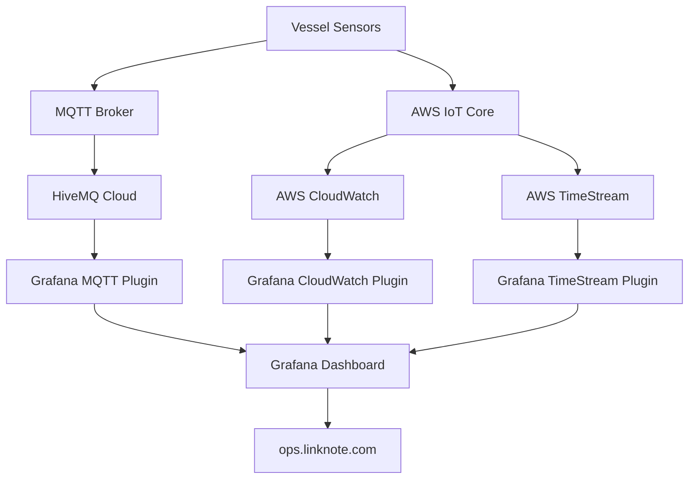

# BC Ferries Grafana Cloud API Integration Guide

## Overview

This document details the API integrations for BC Ferries maritime telemetry monitoring system, connecting vessel data sources to the Grafana Cloud dashboard at **ops.linknote.com**.

## Data Flow Architecture



## API Endpoints

### 1. Grafana Cloud API

**Base URL**: `https://grafana.com/api`
**Authentication**: Bearer token

#### Create Stack
```bash
POST /stacks
Content-Type: application/json
Authorization: Bearer YOUR_GRAFANA_TOKEN

{
  "name": "bcferriesdemo",
  "slug": "bcferriesdemo", 
  "region": "us-east-1",
  "description": "BC Ferries Maritime Operations"
}
```

#### Configure Data Source
```bash
POST /datasources
Content-Type: application/json
Authorization: Bearer YOUR_SERVICE_TOKEN

{
  "name": "AWS CloudWatch",
  "type": "cloudwatch",
  "access": "proxy",
  "jsonData": {
    "authType": "keys",
    "defaultRegion": "us-west-2"
  },
  "secureJsonData": {
    "accessKey": "AWS_ACCESS_KEY",
    "secretKey": "AWS_SECRET_KEY"
  }
}
```

#### Import Dashboard
```bash
POST /dashboards/db
Content-Type: application/json
Authorization: Bearer YOUR_SERVICE_TOKEN

{
  "dashboard": {...dashboard_json...},
  "overwrite": true,
  "folderId": 0
}
```

### 2. AWS IoT Core API

**Base URL**: `https://iot.us-west-2.amazonaws.com`
**Authentication**: AWS Signature Version 4

#### Publish Telemetry Data
```bash
POST /$aws/events
Content-Type: application/json
Authorization: AWS4-HMAC-SHA256 ...

{
  "timestamp": "2025-08-31T07:30:00Z",
  "vessel_id": "001",
  "system": "engine",
  "metrics": {
    "rpm": 1200,
    "temperature": 85.5,
    "fuel_flow": 45.2
  }
}
```

#### MQTT Topics
```bash
# Engine telemetry
ferry/vessel/001/telemetry/engine
{
  "timestamp": "2025-08-31T07:30:00Z",
  "rpm": 1200,
  "temperature": 85.5,
  "fuel_flow": 45.2,
  "oil_pressure": 2.8,
  "hours": 1234.5
}

# Power system telemetry
ferry/vessel/001/telemetry/power
{
  "timestamp": "2025-08-31T07:30:00Z",
  "battery_soc": 85,
  "power_mode": "hybrid",
  "generator_load": 45,
  "shore_power": false
}

# Safety system telemetry
ferry/vessel/001/telemetry/safety
{
  "timestamp": "2025-08-31T07:30:00Z",
  "fire_alarm_status": "normal",
  "bilge_level": 15,
  "co2_level": 400,
  "emergency_stop": false
}

# Navigation telemetry  
ferry/vessel/001/telemetry/navigation
{
  "timestamp": "2025-08-31T07:30:00Z",
  "speed": 12.5,
  "heading": 045,
  "latitude": 49.2827,
  "longitude": -123.1207,
  "route": "vancouver_to_swartz_bay"
}

# Emergency alerts
ferry/vessel/001/alerts/emergency
{
  "timestamp": "2025-08-31T07:30:00Z",
  "alert_type": "fire_alarm",
  "severity": "critical",
  "location": "engine_room",
  "description": "Fire alarm activated",
  "acknowledged": false
}
```

### 3. AWS CloudWatch API

**Base URL**: `https://monitoring.us-west-2.amazonaws.com`
**Authentication**: AWS Signature Version 4

#### Put Custom Metrics
```bash
POST /
Content-Type: application/x-amz-json-1.1
X-Amz-Target: GraniteServiceVersion20100801.PutMetricData
Authorization: AWS4-HMAC-SHA256 ...

{
  "Namespace": "Custom/FerryTelemetry",
  "MetricData": [
    {
      "MetricName": "EngineRPM",
      "Dimensions": [
        {"Name": "VesselID", "Value": "001"},
        {"Name": "System", "Value": "engine"}
      ],
      "Value": 1200,
      "Unit": "Count",
      "Timestamp": "2025-08-31T07:30:00Z"
    }
  ]
}
```

#### Query Metrics (for Grafana)
```bash
GET /?Action=GetMetricStatistics
&Namespace=Custom/FerryTelemetry
&MetricName=EngineRPM
&Dimensions.member.1.Name=VesselID
&Dimensions.member.1.Value=001
&StartTime=2025-08-31T06:30:00Z
&EndTime=2025-08-31T07:30:00Z
&Period=300
&Statistics.member.1=Average
```

### 4. AWS TimeStream API

**Base URL**: `https://query.timestream.us-west-2.amazonaws.com`
**Authentication**: AWS Signature Version 4

#### Write Records
```bash
POST /
Content-Type: application/x-amz-json-1.0
X-Amz-Target: Timestream_20181101.WriteRecords
Authorization: AWS4-HMAC-SHA256 ...

{
  "DatabaseName": "FerryTelemetryDB",
  "TableName": "VesselTelemetry",
  "Records": [
    {
      "Time": "1693463400000",
      "TimeUnit": "MILLISECONDS",
      "Dimensions": [
        {"Name": "vessel_id", "Value": "001"},
        {"Name": "system", "Value": "engine"}
      ],
      "MeasureName": "rpm",
      "MeasureValue": "1200",
      "MeasureValueType": "DOUBLE"
    }
  ]
}
```

#### Query Data (for Grafana)
```sql
SELECT 
  time,
  vessel_id,
  measure_name,
  measure_value::double
FROM FerryTelemetryDB.VesselTelemetry 
WHERE vessel_id = '001'
  AND time >= ago(1h)
  AND measure_name = 'rpm'
ORDER BY time DESC
```

### 5. HiveMQ Cloud API

**Base URL**: `https://console.hivemq.cloud/api/v1`
**Authentication**: Bearer token

#### MQTT Connection
```javascript
const mqtt = require('mqtt')

const client = mqtt.connect('mqtts://your-cluster.s2.eu.hivemq.cloud:8883', {
  username: 'ferry-monitoring',
  password: 'your-password',
  clientId: 'grafana-ferry-monitor'
})

client.on('connect', () => {
  client.subscribe('ferry/vessel/001/telemetry/+')
})

client.on('message', (topic, message) => {
  const data = JSON.parse(message.toString())
  // Forward to Grafana via webhook or store in database
})
```

## Integration Patterns

### 1. Real-time Data Flow

```javascript
// AWS IoT Core Rule to forward to multiple targets
{
  "ruleName": "FerryTelemetryRoute",
  "sql": "SELECT *, topic() as source_topic FROM 'ferry/vessel/+/telemetry/+'",
  "actions": [
    {
      "cloudwatchMetric": {
        "roleArn": "arn:aws:iam::account:role/IoTCloudWatchRole",
        "metricNamespace": "Custom/FerryTelemetry",
        "metricName": "${rpm}",
        "metricValue": "${rpm}",
        "metricUnit": "Count"
      }
    },
    {
      "timestream": {
        "roleArn": "arn:aws:iam::account:role/IoTTimestreamRole", 
        "databaseName": "FerryTelemetryDB",
        "tableName": "VesselTelemetry",
        "dimensions": [
          {"name": "vessel_id", "value": "${vessel_id}"},
          {"name": "system", "value": "${system}"}
        ]
      }
    },
    {
      "republish": {
        "roleArn": "arn:aws:iam::account:role/IoTRepublishRole",
        "topic": "ferry/processed/${vessel_id}/${system}"
      }
    }
  ]
}
```

### 2. Grafana Query Examples

#### CloudWatch Query
```json
{
  "datasource": "AWS CloudWatch",
  "region": "us-west-2",
  "namespace": "Custom/FerryTelemetry",
  "metricName": "EngineRPM",
  "dimensions": {
    "VesselID": "001"
  },
  "statistics": ["Average"],
  "period": "300"
}
```

#### TimeStream Query
```json
{
  "datasource": "AWS TimeStream",
  "database": "FerryTelemetryDB",
  "table": "VesselTelemetry",
  "query": "SELECT time, measure_value::double as rpm FROM $__database.$__table WHERE vessel_id = '$vessel' AND measure_name = 'rpm' AND $__timeFilter ORDER BY time"
}
```

#### MQTT Query
```json
{
  "datasource": "HiveMQ Cloud MQTT",
  "topic": "ferry/vessel/$vessel/telemetry/engine",
  "jsonPath": "$.rpm",
  "dataType": "timeseries"
}
```

### 3. Alert Integration

#### Webhook for Custom Alerts
```javascript
// Express.js webhook endpoint
app.post('/alerts/webhook', (req, res) => {
  const alert = req.body
  
  // Process Grafana alert payload
  const alertData = {
    vessel: alert.groupLabels.vessel,
    alert_name: alert.groupLabels.alertname,
    severity: alert.groupLabels.severity,
    status: alert.status,
    description: alert.annotations.description,
    timestamp: alert.startsAt
  }
  
  // Forward to external systems
  if (alertData.severity === 'critical') {
    sendSMS(alertData)
    notifyPagerDuty(alertData)
  }
  
  sendEmail(alertData)
  logToDatabase(alertData)
  
  res.status(200).json({ received: true })
})
```

## Data Schemas

### 1. Vessel Telemetry Schema
```typescript
interface VesselTelemetry {
  timestamp: string          // ISO 8601 timestamp
  vessel_id: string          // Unique vessel identifier
  system: string             // System category
  location?: string          // Physical location on vessel
  metrics: {
    [key: string]: number    // Dynamic metric values
  }
  status?: string           // Overall system status
  alerts?: Alert[]          // Associated alerts
}

interface Alert {
  id: string
  type: string              // alert type
  severity: 'low' | 'medium' | 'high' | 'critical'
  message: string
  acknowledged: boolean
  timestamp: string
}
```

### 2. CloudWatch Metrics Schema
```json
{
  "Namespace": "Custom/FerryTelemetry",
  "MetricData": [
    {
      "MetricName": "EngineRPM",
      "Dimensions": [
        {"Name": "VesselID", "Value": "001"},
        {"Name": "System", "Value": "engine"},
        {"Name": "Location", "Value": "engine_room"}
      ],
      "Value": 1200.0,
      "Unit": "Count",
      "Timestamp": "2025-08-31T07:30:00.000Z"
    }
  ]
}
```

### 3. TimeStream Record Schema
```json
{
  "Time": "1693463400000",
  "TimeUnit": "MILLISECONDS", 
  "Dimensions": [
    {"Name": "vessel_id", "Value": "001"},
    {"Name": "system", "Value": "engine"},
    {"Name": "metric_type", "Value": "performance"}
  ],
  "MeasureName": "rpm",
  "MeasureValue": "1200.5",
  "MeasureValueType": "DOUBLE"
}
```

## Authentication & Security

### 1. Grafana Service Account
```bash
# Create service account
curl -X POST "https://bcferriesdemo.grafana.net/api/serviceaccounts" \
  -H "Authorization: Bearer $GRAFANA_API_TOKEN" \
  -H "Content-Type: application/json" \
  -d '{
    "name": "ferry-monitoring-service",
    "role": "Admin"
  }'

# Create service account token
curl -X POST "https://bcferriesdemo.grafana.net/api/serviceaccounts/$SA_ID/tokens" \
  -H "Authorization: Bearer $GRAFANA_API_TOKEN" \
  -H "Content-Type: application/json" \
  -d '{
    "name": "ferry-ops-token"
  }'
```

### 2. AWS IAM Policies
```json
{
  "Version": "2012-10-17",
  "Statement": [
    {
      "Effect": "Allow",
      "Action": [
        "iot:Connect",
        "iot:Publish",
        "iot:Subscribe",
        "iot:Receive"
      ],
      "Resource": "arn:aws:iot:us-west-2:account:*"
    },
    {
      "Effect": "Allow", 
      "Action": [
        "cloudwatch:PutMetricData",
        "cloudwatch:GetMetricStatistics",
        "cloudwatch:ListMetrics"
      ],
      "Resource": "*"
    },
    {
      "Effect": "Allow",
      "Action": [
        "timestream:WriteRecords",
        "timestream:Select"
      ],
      "Resource": "arn:aws:timestream:us-west-2:account:database/FerryTelemetryDB/*"
    }
  ]
}
```

## Error Handling

### 1. Data Source Connection Issues
```javascript
// Grafana data source health check
const checkDataSourceHealth = async (datasourceId) => {
  try {
    const response = await grafanaAPI.get(`/datasources/${datasourceId}/health`)
    return response.data.status === 'OK'
  } catch (error) {
    console.error(`Data source ${datasourceId} health check failed:`, error)
    return false
  }
}

// Retry mechanism for failed connections
const retryWithBackoff = async (fn, maxRetries = 3, baseDelay = 1000) => {
  for (let i = 0; i < maxRetries; i++) {
    try {
      return await fn()
    } catch (error) {
      if (i === maxRetries - 1) throw error
      
      const delay = baseDelay * Math.pow(2, i)
      await new Promise(resolve => setTimeout(resolve, delay))
    }
  }
}
```

### 2. Data Quality Validation
```javascript
// Validate telemetry data before sending
const validateTelemetryData = (data) => {
  const errors = []
  
  if (!data.timestamp) errors.push('Missing timestamp')
  if (!data.vessel_id) errors.push('Missing vessel_id')
  if (!data.system) errors.push('Missing system')
  
  // Validate engine metrics
  if (data.system === 'engine') {
    if (data.metrics.rpm < 0 || data.metrics.rpm > 2000) {
      errors.push('Engine RPM out of valid range')
    }
    if (data.metrics.temperature < -40 || data.metrics.temperature > 150) {
      errors.push('Engine temperature out of valid range') 
    }
  }
  
  return errors
}
```

### 3. Circuit Breaker Pattern
```javascript
class CircuitBreaker {
  constructor(threshold = 5, timeout = 60000) {
    this.threshold = threshold
    this.timeout = timeout
    this.failures = 0
    this.state = 'CLOSED'
    this.lastFailure = null
  }
  
  async call(fn) {
    if (this.state === 'OPEN') {
      if (Date.now() - this.lastFailure < this.timeout) {
        throw new Error('Circuit breaker is OPEN')
      }
      this.state = 'HALF_OPEN'
    }
    
    try {
      const result = await fn()
      this.reset()
      return result
    } catch (error) {
      this.recordFailure()
      throw error
    }
  }
  
  recordFailure() {
    this.failures++
    this.lastFailure = Date.now()
    
    if (this.failures >= this.threshold) {
      this.state = 'OPEN'
    }
  }
  
  reset() {
    this.failures = 0
    this.state = 'CLOSED'
    this.lastFailure = null
  }
}
```

## Performance Optimization

### 1. Data Aggregation
```sql
-- TimeStream query with aggregation
SELECT 
  BIN(time, 1m) as time_bucket,
  AVG(CASE WHEN measure_name = 'rpm' THEN measure_value::double END) as avg_rpm,
  MAX(CASE WHEN measure_name = 'temperature' THEN measure_value::double END) as max_temp,
  COUNT(*) as data_points
FROM FerryTelemetryDB.VesselTelemetry
WHERE vessel_id = '001' 
  AND time >= ago(1h)
GROUP BY BIN(time, 1m)
ORDER BY time_bucket
```

### 2. Connection Pooling
```javascript
// MQTT connection pool
class MQTTConnectionPool {
  constructor(options) {
    this.options = options
    this.pool = []
    this.maxConnections = options.maxConnections || 10
  }
  
  async getConnection() {
    if (this.pool.length > 0) {
      return this.pool.pop()
    }
    
    if (this.activeConnections < this.maxConnections) {
      return this.createConnection()
    }
    
    // Wait for available connection
    return new Promise((resolve) => {
      this.waitingQueue.push(resolve)
    })
  }
  
  releaseConnection(connection) {
    if (this.waitingQueue.length > 0) {
      const resolve = this.waitingQueue.shift()
      resolve(connection)
    } else {
      this.pool.push(connection)
    }
  }
}
```

## Monitoring & Observability

### 1. Integration Health Monitoring
```javascript
// Monitor data source health
const monitorIntegrations = async () => {
  const dataSources = [
    { name: 'AWS CloudWatch', id: 'cloudwatch' },
    { name: 'AWS TimeStream', id: 'timestream' },
    { name: 'HiveMQ MQTT', id: 'mqtt' }
  ]
  
  const healthStatus = {}
  
  for (const ds of dataSources) {
    try {
      const health = await checkDataSourceHealth(ds.id)
      healthStatus[ds.name] = {
        status: health ? 'healthy' : 'unhealthy',
        lastCheck: new Date().toISOString()
      }
    } catch (error) {
      healthStatus[ds.name] = {
        status: 'error',
        error: error.message,
        lastCheck: new Date().toISOString()
      }
    }
  }
  
  // Send to monitoring dashboard
  await sendMetrics('integration_health', healthStatus)
}
```

### 2. Performance Metrics
```javascript
// Track API performance
const trackAPIPerformance = (endpoint, duration, success) => {
  const metrics = {
    endpoint,
    duration,
    success,
    timestamp: Date.now()
  }
  
  // Send to CloudWatch
  cloudWatch.putMetricData({
    Namespace: 'Custom/APIPerformance',
    MetricData: [
      {
        MetricName: 'ResponseTime',
        Value: duration,
        Unit: 'Milliseconds',
        Dimensions: [
          { Name: 'Endpoint', Value: endpoint },
          { Name: 'Status', Value: success ? 'Success' : 'Error' }
        ]
      }
    ]
  })
}
```

## Testing

### 1. Integration Tests
```javascript
// Jest test for Grafana integration
describe('Grafana Cloud Integration', () => {
  test('should create data source successfully', async () => {
    const dataSource = {
      name: 'Test CloudWatch',
      type: 'cloudwatch',
      jsonData: { defaultRegion: 'us-west-2' }
    }
    
    const response = await grafanaAPI.post('/datasources', dataSource)
    expect(response.status).toBe(200)
    expect(response.data.name).toBe('Test CloudWatch')
  })
  
  test('should query metrics from CloudWatch', async () => {
    const query = {
      namespace: 'Custom/FerryTelemetry',
      metricName: 'EngineRPM',
      dimensions: { VesselID: '001' }
    }
    
    const data = await queryCloudWatch(query)
    expect(data).toHaveProperty('MetricDataResults')
    expect(data.MetricDataResults.length).toBeGreaterThan(0)
  })
})
```

### 2. Load Testing
```javascript
// Artillery load test configuration
module.exports = {
  config: {
    target: 'https://bcferriesdemo.grafana.net',
    phases: [
      { duration: '2m', arrivalRate: 10 },
      { duration: '5m', arrivalRate: 20 },
      { duration: '2m', arrivalRate: 10 }
    ],
    payload: {
      path: './telemetry-data.csv',
      fields: ['vessel_id', 'system', 'metric', 'value']
    }
  },
  scenarios: [
    {
      name: 'Query dashboard data',
      weight: 70,
      flow: [
        { get: { url: '/api/datasources/proxy/1/api/v1/query?query=ferry_engine_rpm' } }
      ]
    },
    {
      name: 'Send telemetry data',
      weight: 30,
      flow: [
        { post: { url: '/api/webhooks/telemetry', json: { vessel_id: '001', rpm: 1200 } } }
      ]
    }
  ]
}
```

This comprehensive API integration guide provides all the necessary information to connect vessel telemetry data to the Grafana Cloud monitoring dashboard. The implementation supports real-time data streaming, historical data queries, and robust error handling for production maritime operations.